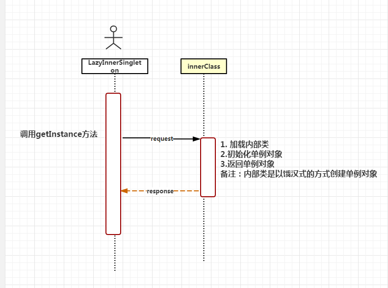

# 单例总结 #
<table border="1px" align="center" bordercolor="black" width="100%" height="100px">
    <tr align="center">
        <td>存在的问题</td>
        <td>多线程</td>
        <td>反射</td>
        <td>序列化</td>
    </tr>
    <tr align="center">
        <td>饿汉式</td>
        <td>N</td>
        <td>Y</td>
        <td>Y</td>
    </tr>
	<tr align="center">
        <td>懒汉式</td>
        <td>Y</td>
        <td>Y</td>
        <td>Y</td>
    </tr>
	<tr align="center">
		<td>枚举式</td>
		<td>N</td>
		<td>N</td>
		<td>N</td>
	</tr>
</table>

## 饿汉式 ##
### 优点：不需要考虑多线程问题 ###
### 缺点：类加载的时候就创建，不是按需创建，消耗较大的内存，存在反射和序列化的问题，需要去解决 ###
## 懒汉式 ##
### 优点：需要的时候才进行创建，占用内存少 ###
### 缺点：会存在多线程的问题，需要使用同步技术去解决，所以性能会下降，存在反射和序列化的问题，需要去解决 ###
## 枚举式 ##
### 优点：不需要考虑多线程、反射、序列化等问题 ###

